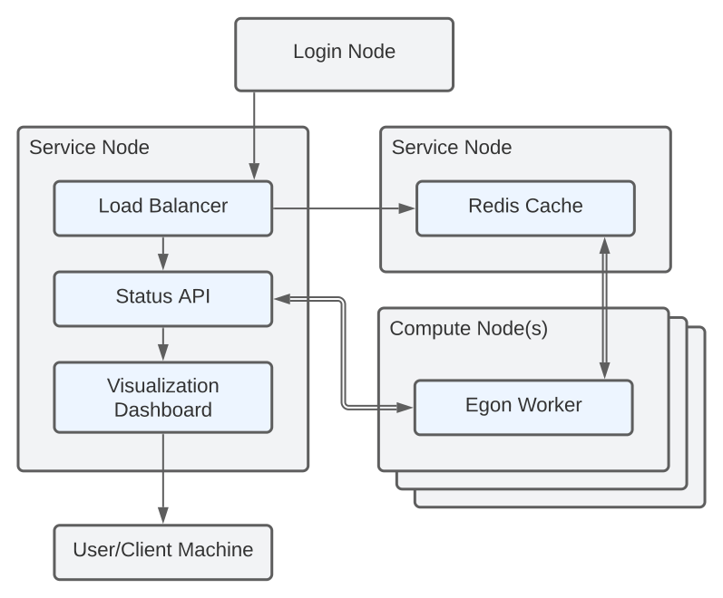

# Technical References

The Egon Framework leverages multiple running services to facilitate job deployment and monitoring.
An example deployment is provided in the diagram below.
Each running service comes bundled with a dedicated commandline utility for configuring/deploying the running service.

<figure markdown>
  
  <figcaption>
    <b>Figure 1</b> A networking diagram detailing communication between components of the Egon Framework in a distributed computing environment.
    Egon components (blue) are run across several virtual or physical machines (grey).
    One or more service nodes host Egon services used to support the <i>worker</i> processes running on compute machines.
  </figcaption>
</figure>

## Applications and Components

For detailed references on a specific application in the Egon Framework, select the application from the list below.

::cards::

- title: Egon
  content: The core Python package of the Egon Framework used to build and deploy parallel software.
  url: ../egon/_index.html

- title: Egon Worker
  content: The Egon parallelization engine responsible for spawning and managing child processes.
  url: ../egon-worker/_index.html

- title: Egon Dashboard
  content: A lightweight web dashboard for visualizing running Egon pipelines.
  url: ../dashboard

- title: Status API Server  
  content: A RESTful API server for monitoring the status of Egon jobs and processes.
  url: ../status-api-server/_index.html

::/cards::

## Design Contracts and Specifications

High level design documentation for Egon interfaces and services.

::cards::

- title: Status API Contract  
  content: OpenAPI specification for the Egon Status API.
  url: ../status-api-schema/_index.html

::/cards::